# Synapse — Documentação Funcional

Guia de cada tela do frontend, do ponto de vista de quem usa: para que serve,
o que mostra e como se conecta com o resto do sistema. Não é documentação de
código — para arquitetura e decisões técnicas, veja o `README.md` da pasta
`frontend/` e os comentários nos próprios arquivos.

As capturas abaixo foram geradas com dados de demonstração: seis arquitetos
fictícios avaliados nas 100 competências do catálogo, em dois ciclos (o
anterior sempre concluído; no atual, a situação varia por pessoa — de
propósito, ver abaixo), com PDI, OKRs, trilhas, mentorias, evidências e
certificações coerentes entre si — o gap que aparece na Análise de Lacunas de
uma pessoa é o mesmo que motivou o item de PDI dela. Os níveis não são fixos
à mão: cada arquiteto tem um domínio forte e um domínio de lacuna declarados,
e a nota de cada competência é gerada a partir disso, então a distribuição
varia de pessoa para pessoa como aconteceria de verdade — veja `seedDemo()`
em `backend/src/db/seed-demo.ts` para a regra exata.

Duas razões diferentes fazem uma tela mostrar "—" no lugar de um nível, e as
capturas têm as duas de propósito:

1. **Avaliação ainda não oficial** — Carla Souza está com a autoavaliação em
   revisão e Diego Rocha ainda em rascunho no ciclo atual; até o Tech Lead
   concluir, o Painel e a Análise de Lacunas não contam a nota deles (ver
   Seção 6, "Avaliações"). É o comportamento correto, não dado faltando.
2. **Dado real de desenvolvimento** — **Daniel Zibordi**, em Time e no
   Painel, não é dado de demonstração: é um arquiteto real, cadastrado à mão
   durante o desenvolvimento, sem avaliação lançada. Preservei-o de
   propósito: apagar dado que o time cadastrou (mesmo que de teste) para
   "limpar a demonstração" seria destruir algo que não me pertence decidir
   descartar.

## O que é o Synapse

Uma ferramenta de gestão de capacidades para times de Arquitetura de
Soluções: mapeia quais competências técnicas o time tem hoje, mede a
distância entre o nível atual e o esperado por cargo, e conecta esse
diagnóstico a planos de desenvolvimento, trilhas de aprendizagem e mentoria.

O fio condutor declarado no próprio produto (visível no topo de toda tela)
é **Aprender → Praticar → Evidenciar → Feedback → Maestria** — o ciclo que
liga estudo a prática registrada, a avaliação, a repetição.

## Como acessar

```sh
cd backend && docker compose up     # API, Postgres, Redis
cd frontend && npm run dev          # http://localhost:8080
```

O primeiro acesso a uma instância nova pede a criação de uma conta
administradora; depois disso, é login normal por e-mail e senha.

Para carregar a massa de demonstração usada nestas capturas (seis arquitetos,
avaliações, PDI, OKRs, trilhas, mentorias, evidências e certificações):

```sh
cd backend
npm run seed:demo          # carrega
npm run seed:demo:clear    # remove, sem tocar no que o time cadastrou
```

É seguro rodar em cima de uma base já em uso — tudo é prefixado com `demo-`
e reidentificável.

---

## 1. Login

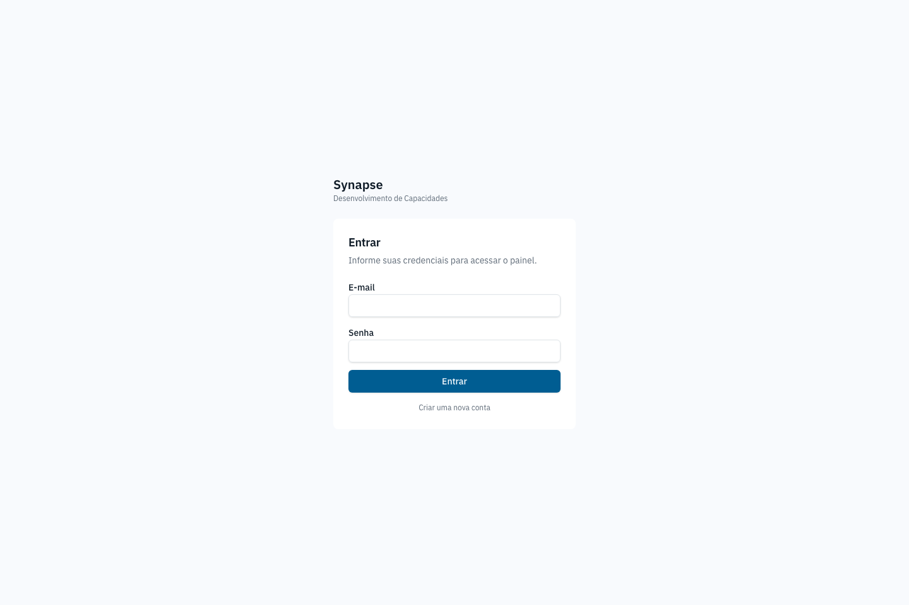

Porta de entrada. Numa instância sem nenhum usuário cadastrado, o formulário
vira "Primeiro acesso" e cria a conta de administrador; do contrário, é login
comum. Sem sessão válida, nenhuma outra tela do app é acessível.

## 2. Painel

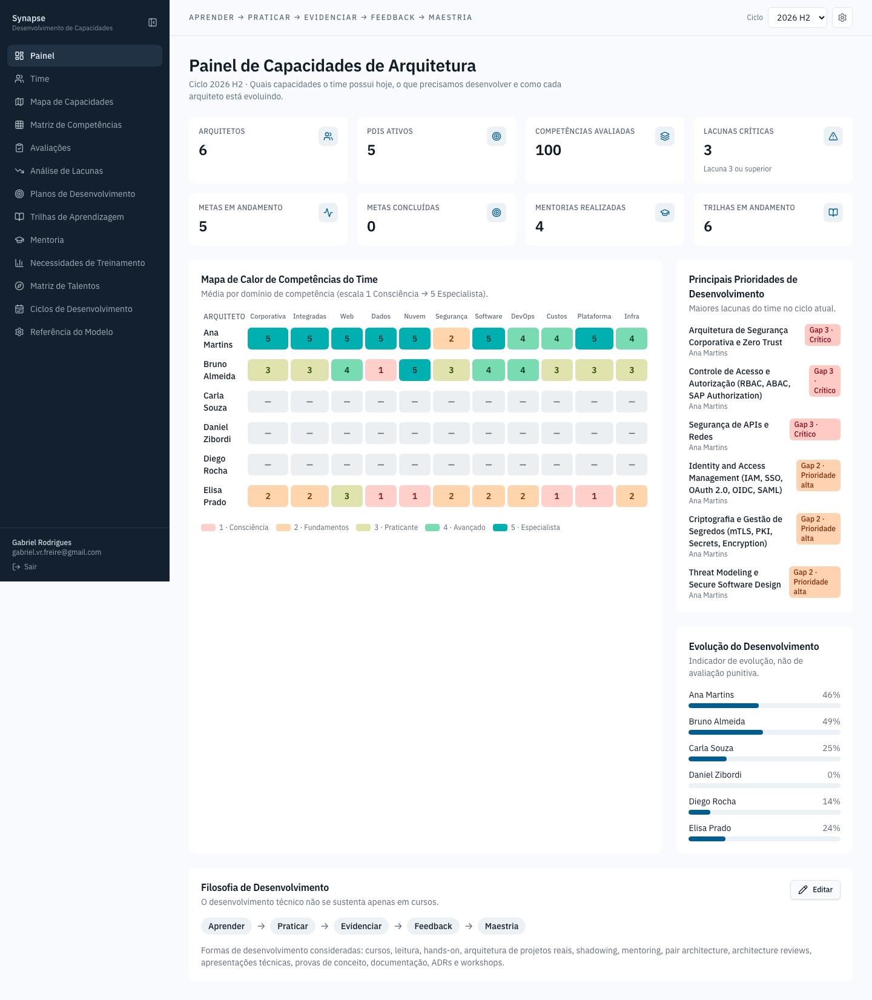

Visão executiva do ciclo ativo: quantos arquitetos, planos de desenvolvimento
em curso, competências avaliadas, lacunas críticas, sessões de mentoria e
trilhas em andamento. Abaixo, um mapa de calor cruza cada arquiteto com cada
domínio de competência (média 1–5), as maiores prioridades de desenvolvimento
do time e o progresso individual de cada pessoa. No rodapé, a filosofia de
desenvolvimento do time (o ciclo Aprender→Praticar→Evidenciar→Feedback→
Maestria) é editável — é o único texto institucional que o app deixa a cargo
de quem administra.

## 3. Time

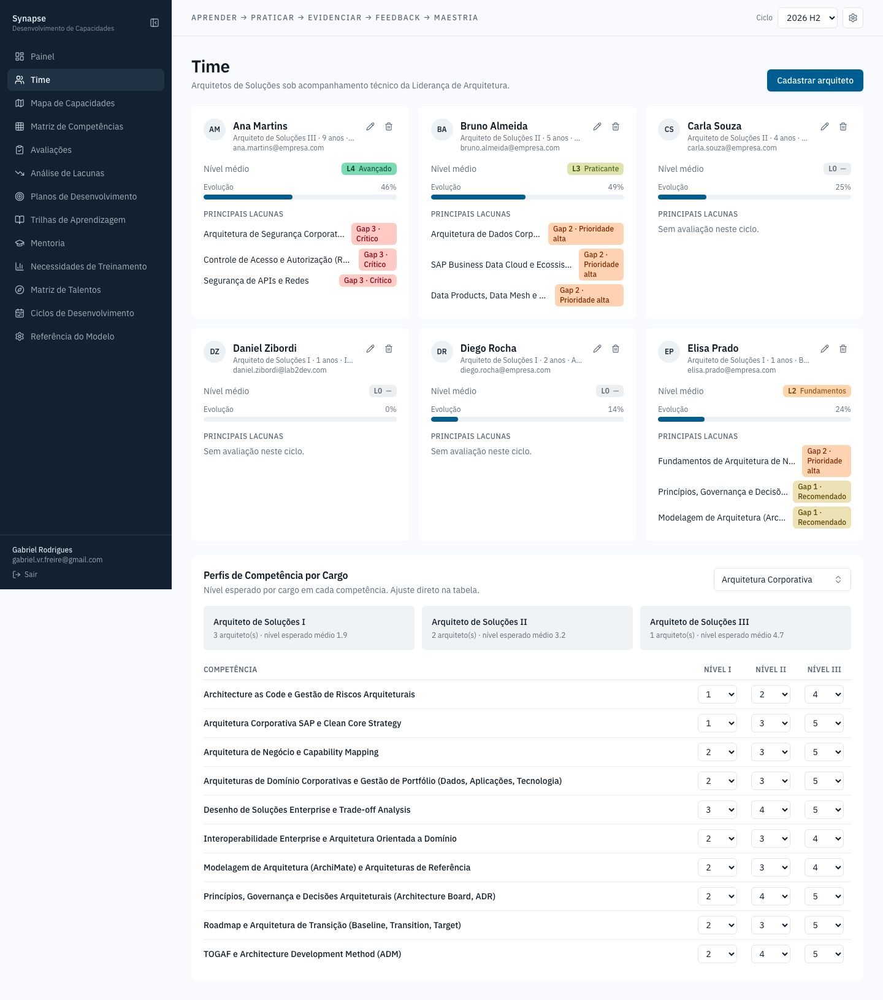

Cadastro dos arquitetos: cargo, tempo de casa, e-mail, nível médio e
evolução no ciclo. Cada card permite editar ou excluir a pessoa. Abaixo, os
**Perfis de Competência por Cargo** — a tabela que define, para cada
competência e cada um dos três níveis de cargo (Arquiteto de Soluções I, II,
III), qual o nível esperado. É aqui que se ajusta a régua contra a qual todo
mundo é avaliado, direto na tabela, sem precisar abrir um formulário.

## 4. Mapa de Capacidades

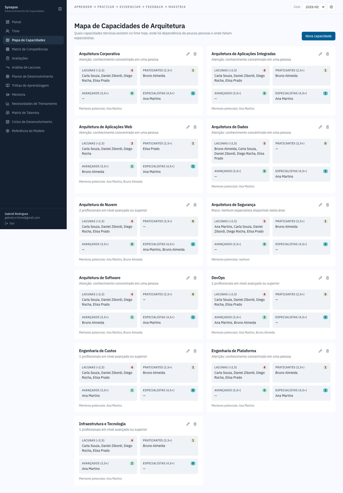

Uma visão por domínio de arquitetura (Corporativa, Dados, Nuvem, Segurança…)
focada em risco organizacional: quantas pessoas têm lacuna nesse domínio,
quantas já são praticantes, avançadas ou especialistas, e — o dado mais
importante da tela — se existe **algum especialista disponível**, porque um
domínio inteiro dependendo de uma única pessoa é o risco que esta tela existe
para expor. Cada card lista quem são os mentores potenciais daquele domínio.

## 5. Matriz de Competências

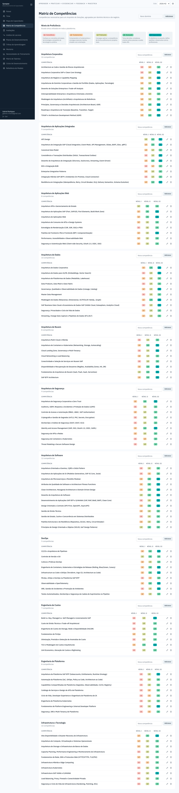

O catálogo mestre: toda competência técnica que o time avalia, agrupada por
domínio, com o nível esperado por cargo. É daqui que nascem as opções que
aparecem em Avaliações, Planos de Desenvolvimento e Trilhas — mudar um nome
ou nível aqui propaga para o app inteiro. Permite criar domínio novo, criar
competência dentro de um domínio, editar (nome e níveis esperados) e excluir
— com um cartão de confirmação ao excluir com sucesso.

## 6. Avaliações

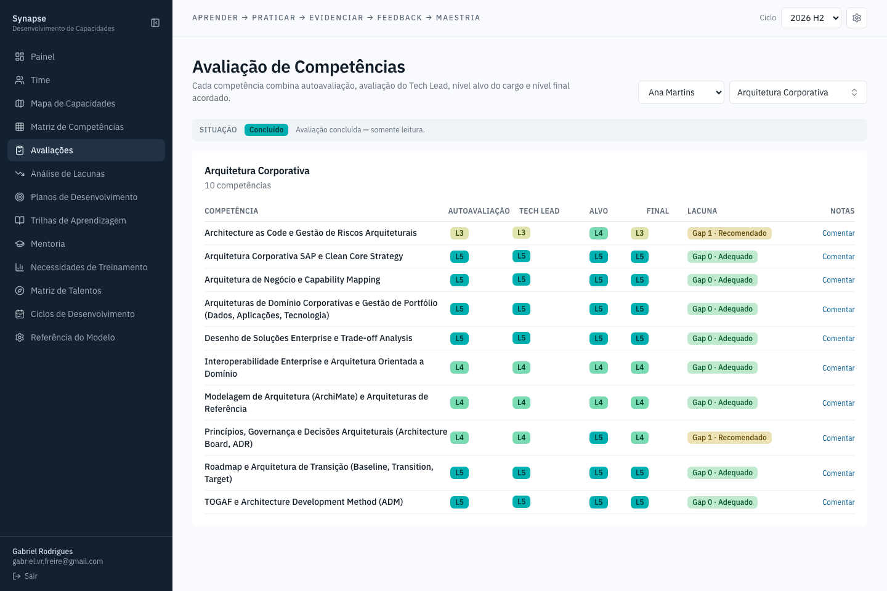

O formulário central do ciclo: para um arquiteto e um domínio, cada
competência recebe autoavaliação, avaliação do Tech Lead, nível alvo (do
Perfil por Cargo) e nível final acordado entre as duas partes — mais um
espaço de notas por competência, com histórico de quando cada comentário foi
salvo.

**A avaliação é um processo, não um formulário solto**, com três situações:

- **Rascunho** — o próprio arquiteto preenche a autoavaliação; a nota do Tech
  Lead e a final ficam bloqueadas até lá. Um botão **Enviar para revisão**
  fecha essa etapa.
- **Em revisão** — o Tech Lead (hoje, quem tem papel de administrador) avalia
  e concilia; a autoavaliação já enviada fica só leitura para o arquiteto. Um
  ícone de divergência aparece quando a nota do arquiteto e a do Tech Lead
  discordam.
- **Concluído** — um botão **Concluir avaliação**, do Tech Lead, fecha o
  ciclo: a nota final vira oficial e a tela inteira passa a somente leitura.

**Só avaliação `Concluído` conta para o resto do produto.** O Painel, a
Análise de Lacunas, o Mapa de Capacidades e o índice de evolução de cada
pessoa ignoram avaliação em rascunho ou em revisão — por isso é normal ver
"—" no lugar do nível de alguém que ainda não fechou a própria avaliação no
ciclo: não é dado faltando, é dado ainda não oficial.

## 7. Análise de Lacunas

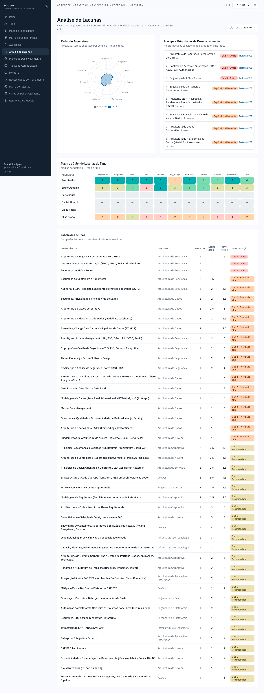

Cruza as avaliações do ciclo com o nível esperado e devolve três leituras da
mesma lacuna: uma tabela ordenável, um radar comparando nível atual e
esperado por domínio, e um mapa de calor do time inteiro. Existe para
responder "onde priorizar" sem precisar somar manualmente linha por linha da
Matriz.

## 8. Planos de Desenvolvimento

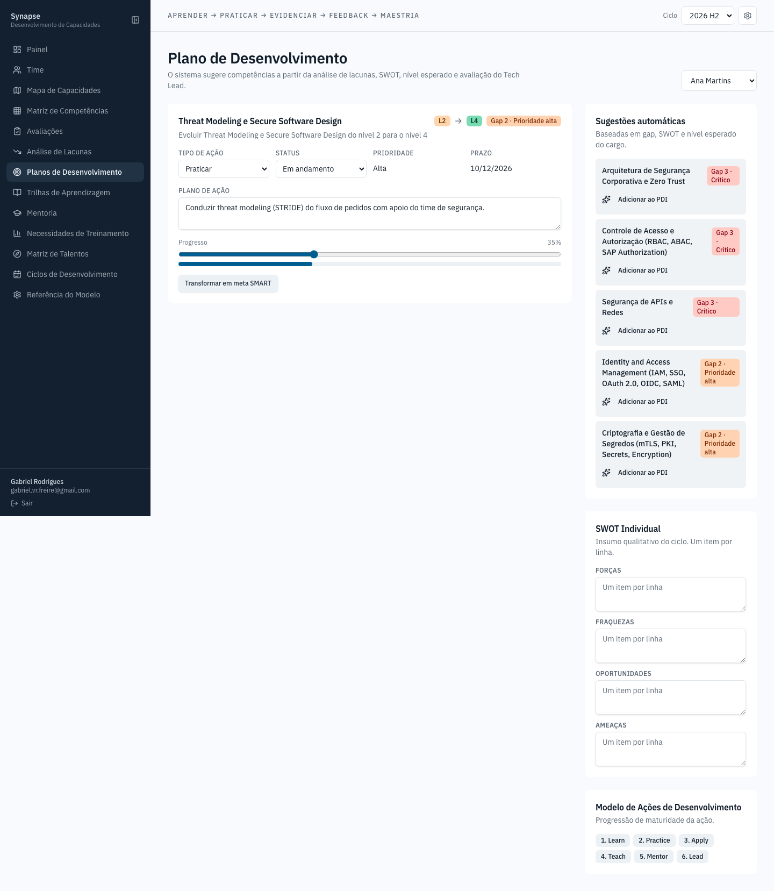

O PDI (Plano de Desenvolvimento Individual) de cada arquiteto: itens de ação
ligados a uma competência com lacuna, tipo de ação (Aprender, Praticar,
Aplicar, Ensinar, Mentorar, Liderar — a mesma taxonomia da Referência do
Modelo), status e progresso. É onde uma lacuna identificada na Análise de
Lacunas vira compromisso com prazo.

## 9. Trilhas de Aprendizagem

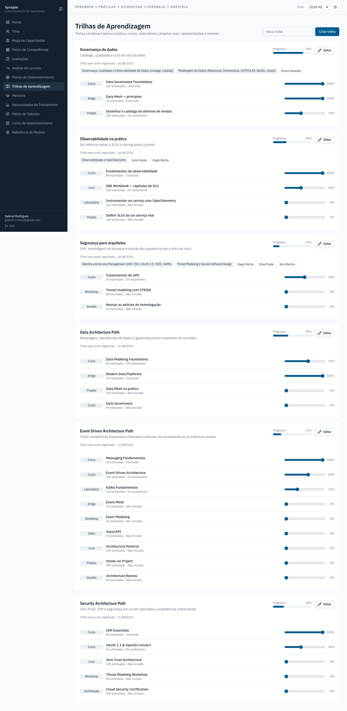

Percursos de estudo — cursos, leituras, hands-on — atribuídos a arquitetos,
com tipo, nome, carga horária e status por item. Uma trilha pode ficar
associada a uma ou mais competências, fechando o elo entre "o que falta
desenvolver" e "o que fazer a respeito".

## 10. Mentoria

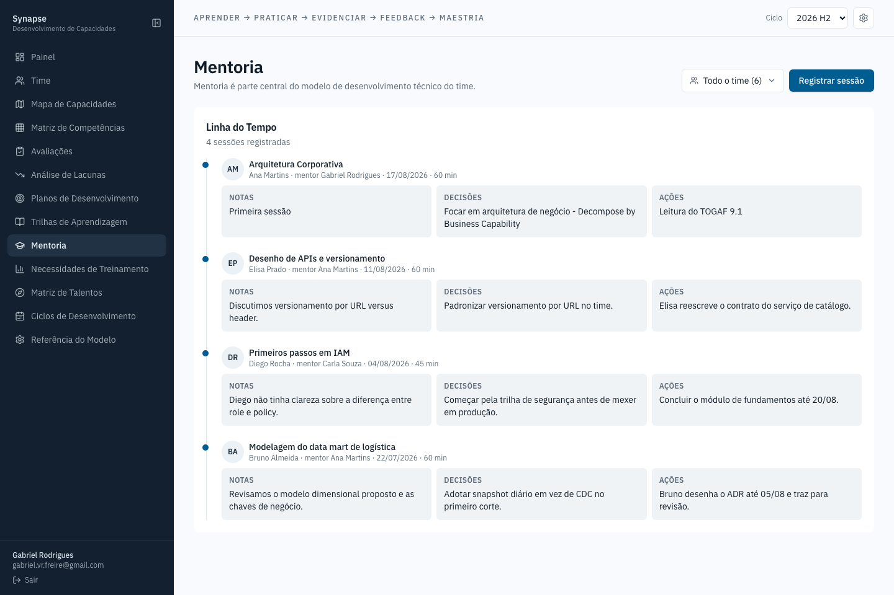

Linha do tempo das sessões de mentoria registradas: quem mentorou quem, em
que tema, por quanto tempo, e três campos por sessão — notas da conversa,
decisões tomadas, ações combinadas. Cada campo tem um ícone de ajuda (i) que
explica, ao passar o mouse, para que serve especificamente aquele campo. O
formulário exige os quatro campos principais preenchidos antes de salvar.

## 11. Necessidades de Treinamento

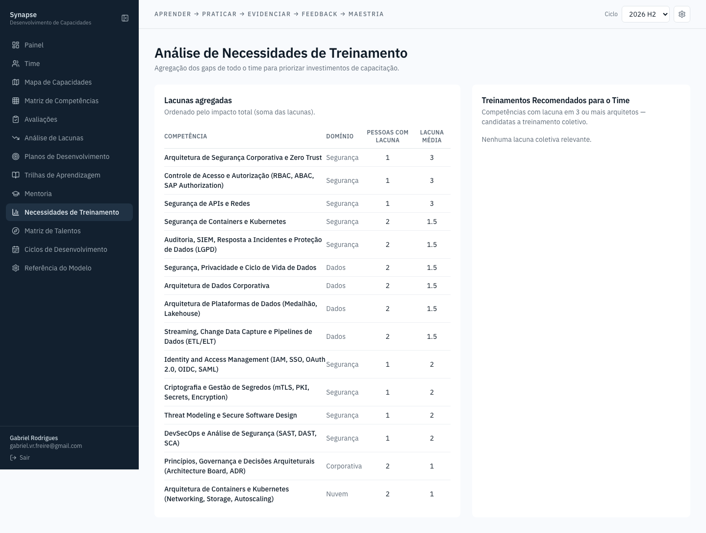

Agregação das lacunas do time inteiro por competência — a pergunta "se eu só
pudesse comprar um treinamento este trimestre, qual entregaria mais valor
para mais gente" respondida em uma lista ordenada por quantas pessoas
compartilham aquela lacuna.

## 12. Matriz de Talentos

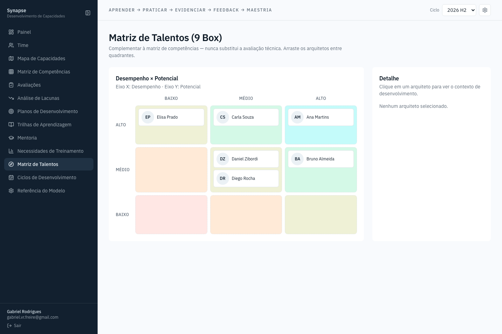

A 9 Box do time: desempenho×potencial, com cada arquiteto posicionado como
um cartão arrastável entre os nove quadrantes. Ao selecionar uma pessoa, o
painel lateral mostra as maiores lacunas dela, o PDI ativo e uma recomendação
de desenvolvimento gerada a partir do quadrante em que está.

## 13. Ciclos de Desenvolvimento

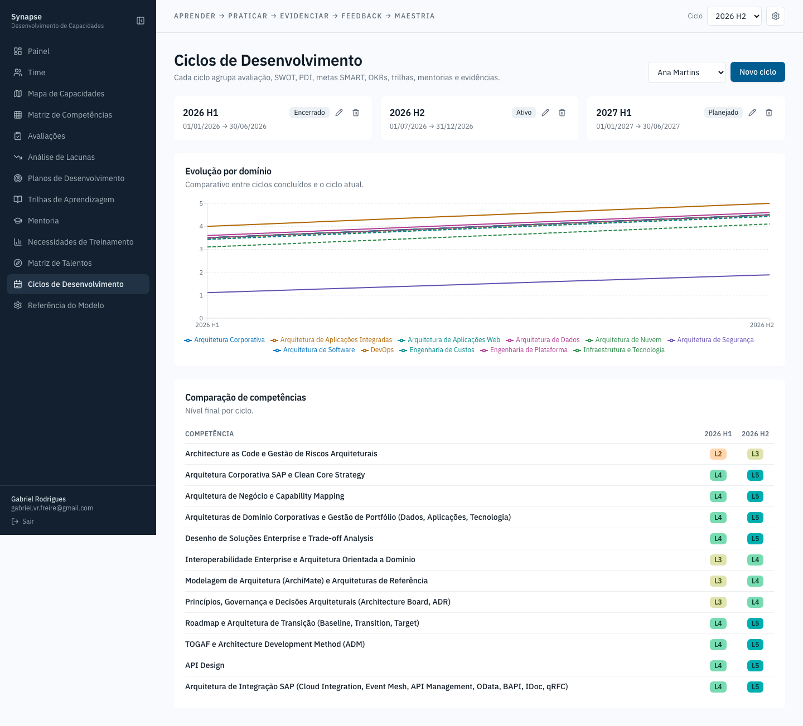

Os períodos que organizam todo o resto do app (avaliações, PDIs, metas giram
em torno de um ciclo ativo). Cada ciclo tem início, fim e situação
(Planejado, Ativo, Encerrado); o seletor de ciclo no cabeçalho, presente em
toda tela, decide qual ciclo está "em foco" no momento.

## 14. Referência do Modelo

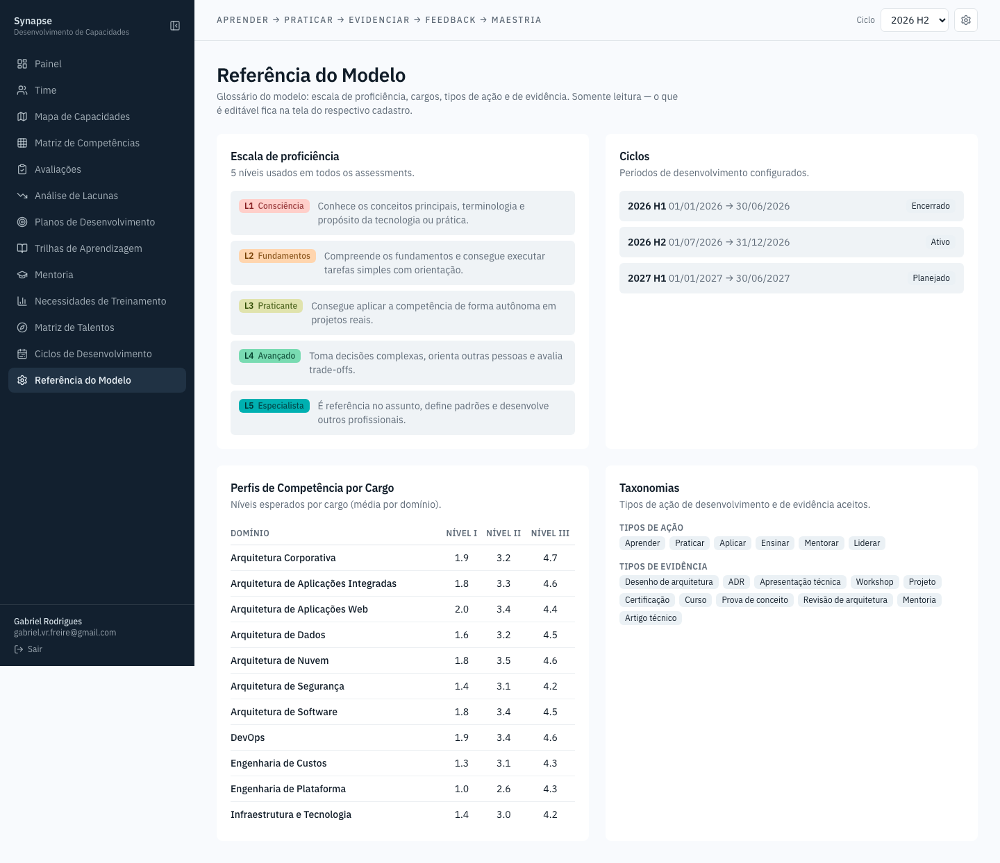

Glossário somente-leitura: a escala de proficiência (o que cada nível de 1 a
5 significa), os ciclos cadastrados, o nível esperado médio por domínio e
cargo, e as duas taxonomias fixas do modelo — tipos de ação de
desenvolvimento e tipos de evidência aceitos. Existe para tirar dúvida sem
precisar perguntar: "o que muda de um nível 3 para um nível 4?"

## 15. Detalhe do Arquiteto

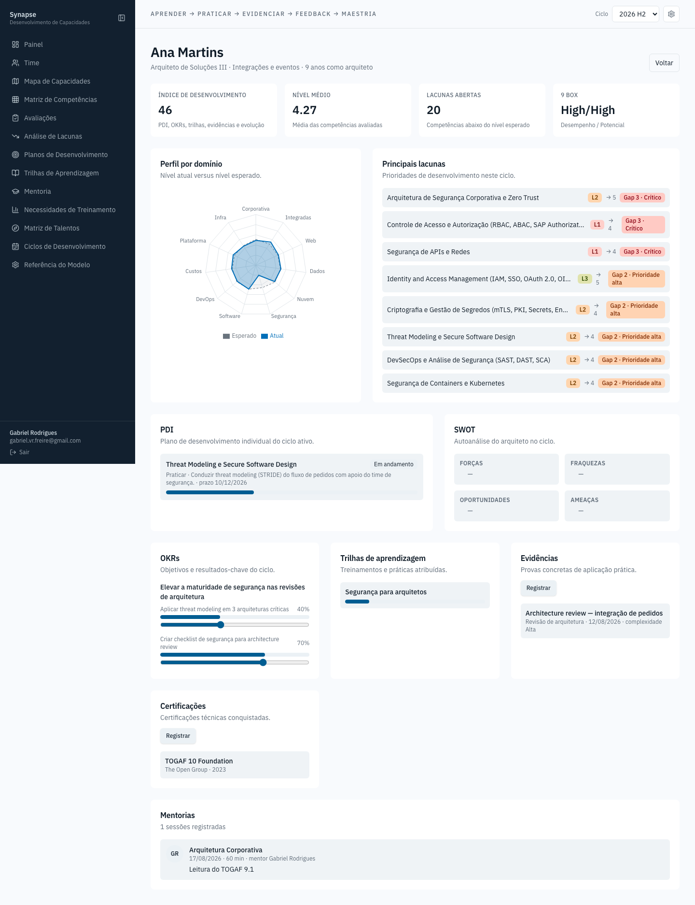

A visão de 360° de uma pessoa — acessível clicando no nome em qualquer lista
do app. Reúne num só lugar: índice de desenvolvimento, nível médio, lacunas
abertas, posição na 9 Box, radar de perfil por domínio, principais lacunas,
PDI, SWOT, OKRs, trilhas atribuídas, evidências registradas, certificações e
histórico de mentoria. É a tela que um Tech Lead abriria antes de uma
conversa de carreira.

---

## Idioma e tema

O seletor no canto superior direito (ícone de engrenagem) troca o idioma da
interface entre português, inglês e espanhol, e o tema entre claro, escuro e
"acompanhar o sistema". A escolha fica salva no navegador.

## Regerando as capturas

As imagens desta pasta são geradas por script, não tiradas à mão — quando uma
tela mudar de forma visível, regenere em vez de editar a imagem:

```sh
cd frontend
SCREENSHOT_EMAIL=seu@email.com SCREENSHOT_PASSWORD=sua-senha npm run screenshots
```

Requer o backend (`docker compose up`) e o frontend (`npm run dev`) já
rodando. O script está em `scripts/screenshot.mjs`.
