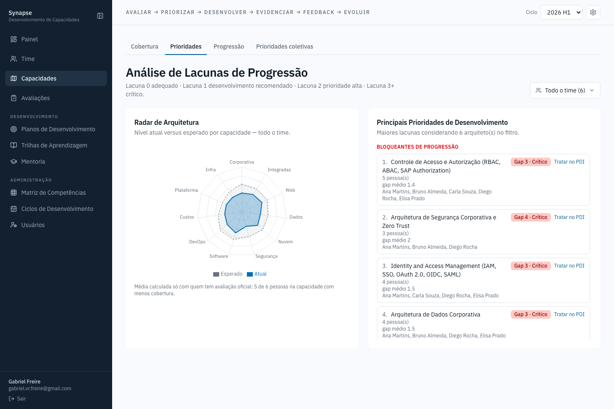
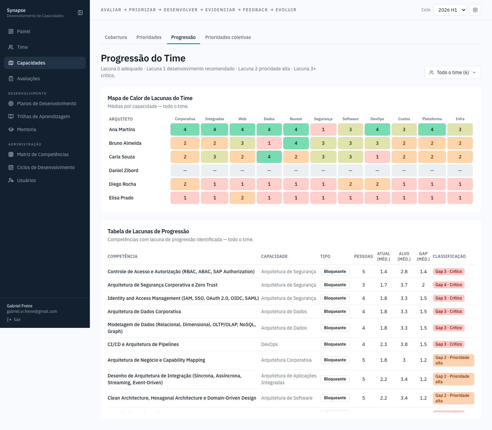
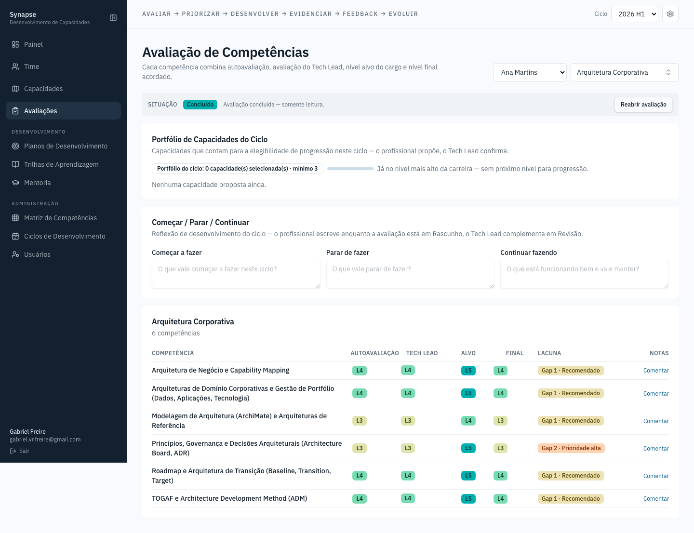
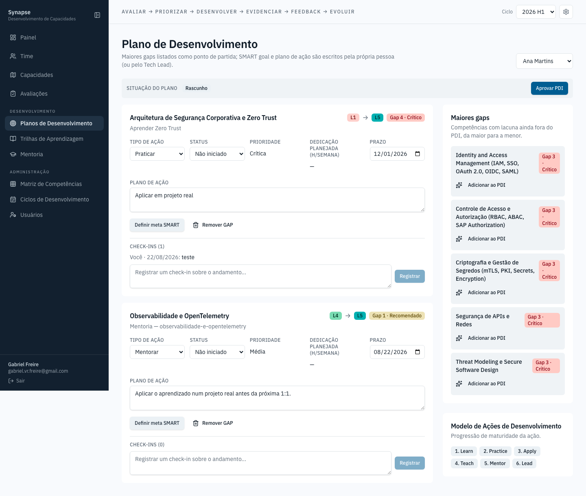
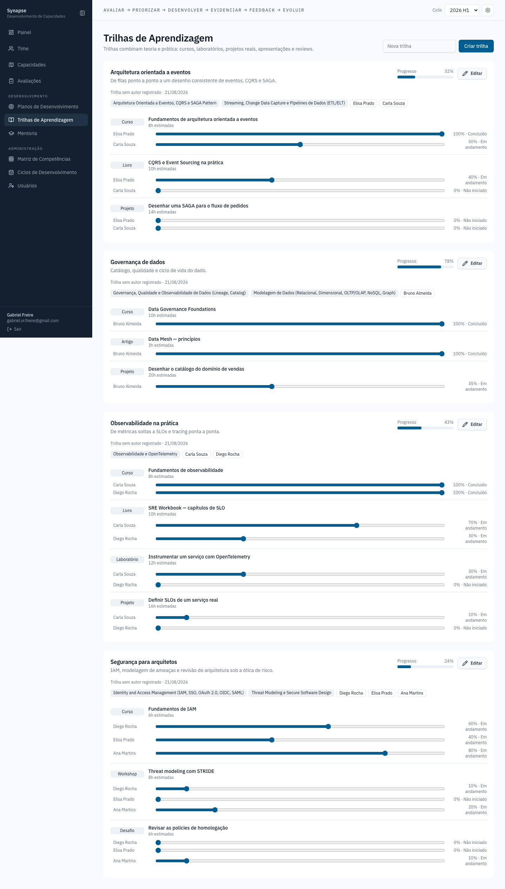
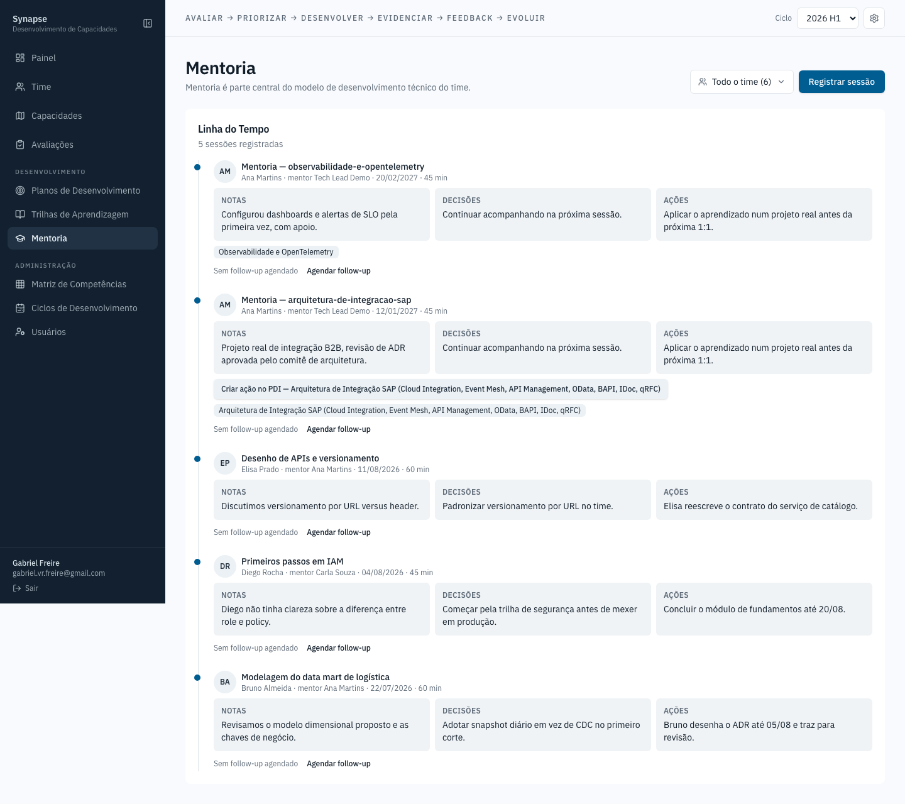
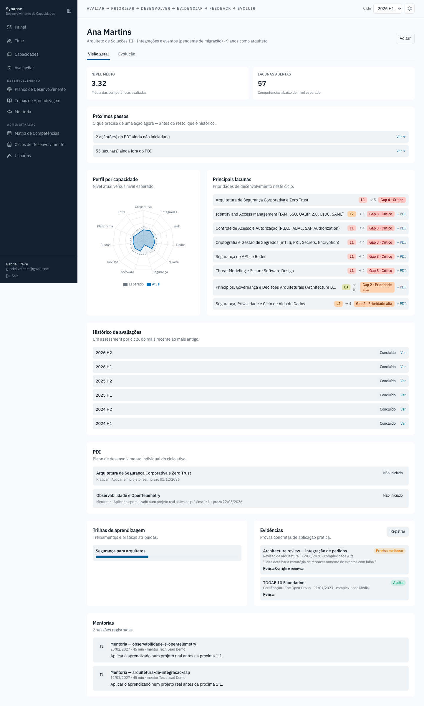
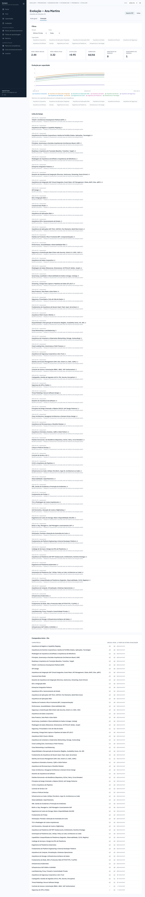

# Synapse — Documentação Funcional

Guia de cada tela do frontend, do ponto de vista de quem usa: para que serve,
o que mostra e como se conecta com o resto do sistema. Não é documentação de
código — para arquitetura e decisões técnicas, veja o `README.md` da pasta
`frontend/` e os comentários nos próprios arquivos.

As capturas abaixo foram geradas com dados de demonstração: cinco arquitetos
fictícios avaliados nas 66 competências do catálogo real, em seis ciclos
seguidos (2024 H1 até 2026 H2, mais um ciclo futuro planejado), com PDI,
trilhas, mentorias, evidências e certificações coerentes entre si — o gap que
aparece em Capacidades de uma pessoa é o mesmo que motivou o item de PDI
dela. Os níveis não são fixos à mão: cada arquiteto tem um domínio forte e um
domínio de lacuna declarados, e a nota de cada competência é gerada a partir
disso, então a distribuição varia de pessoa para pessoa como aconteceria de
verdade — veja `seedDemo()` em `backend/src/db/seed-demo.ts` para a regra
exata, e `backend/src/db/seed-evolution-history.ts` para os ciclos
anteriores a 2026 usados na tela de Evolução.

Duas razões diferentes fazem uma tela mostrar "—" no lugar de um nível, e as
capturas têm as duas de propósito:

1. **Avaliação ainda não oficial** — até o Tech Lead concluir a avaliação do
   ciclo, o Painel e as telas de Capacidades não contam a nota da pessoa (ver
   Seção 5, "Avaliações"). É o comportamento correto, não dado faltando.
2. **Dado real de desenvolvimento** — **Daniel Zibord**, em Time e no
   Painel, não é dado de demonstração: é um arquiteto real, cadastrado à mão
   durante o desenvolvimento, sem avaliação lançada. Preservado de
   propósito: apagar dado que o time cadastrou (mesmo que de teste) para
   "limpar a demonstração" seria destruir algo que não é meu de descartar.

## O que é o Synapse

Uma ferramenta de gestão de capacidades para times de Arquitetura de
Soluções: mapeia quais competências técnicas o time tem hoje, mede a
distância entre o nível atual e o esperado por cargo, e conecta esse
diagnóstico a planos de desenvolvimento, trilhas de aprendizagem e mentoria —
e, a partir da Rodada 10, também acompanha como esse nível evoluiu ao longo
do tempo, não só o retrato do ciclo atual.

O fio condutor declarado no próprio produto (visível no topo de toda tela)
é **Avaliar → Priorizar → Desenvolver → Evidenciar → Feedback → Evoluir** —
o ciclo que liga diagnóstico a plano, a prática registrada, à avaliação, à
evolução observada ao longo do tempo.

## Como acessar

```sh
cd backend && docker compose up     # API, Postgres, Redis
cd frontend && npm run dev          # http://localhost:8080
```

O primeiro acesso a uma instância nova pede a criação de uma conta
administradora; depois disso, é login normal por e-mail e senha.

Para carregar a massa de demonstração usada nestas capturas:

```sh
cd backend
npm run seed:demo                # seis arquitetos, avaliações, PDI, trilhas,
                                  # mentorias, evidências e certificações
npm run seed:evolution-history   # + quatro ciclos anteriores (2024-2025),
                                  # backfill de evolução e duas mentorias
                                  # com nível observado, pra Evolução (Seção
                                  # 12.2) ter mais de um ponto no tempo
npm run seed:demo:clear          # remove a massa de seed:demo, sem tocar
                                  # no que o time cadastrou
```

É seguro rodar em cima de uma base já em uso — tudo é prefixado com `demo-`
e reidentificável.

---

## 1. Login


Porta de entrada. Numa instância sem nenhum usuário cadastrado, o formulário
vira "Primeiro acesso" e cria a conta de administrador; do contrário, é login
comum. Sem sessão válida, nenhuma outra tela do app é acessível.

## 2. Painel


Visão executiva do ciclo ativo: quantos arquitetos, PDIs ativos, competências
avaliadas, lacunas críticas, mentorias realizadas e trilhas em andamento.
Abaixo, um mapa de calor cruza cada arquiteto com cada capacidade (média
1–5) e as maiores prioridades de desenvolvimento do time, cada uma já
apontando de quem é a lacuna.

## 3. Time


Cadastro dos arquitetos: cargo, tempo de casa, e-mail, Tech Lead responsável
e especialização principal. Cada card permite editar ou desativar a pessoa
(arquiteto nunca é excluído de verdade — só desativado, pra preservar o
histórico de avaliações e PDI que já existe ligado a ele).

## 4. Capacidades

A antiga trinca "Mapa de Capacidades / Análise de Lacunas / Necessidades de
Treinamento" — mais a nova aba de Progressão — vive hoje sob um único item de
menu, com quatro abas internas. Cada uma responde uma pergunta diferente
sobre o mesmo dado.

### 4.1 Cobertura


Uma visão por capacidade de arquitetura (Corporativa, Dados, Nuvem,
Segurança…) focada em risco organizacional: quantas pessoas estão em
desenvolvimento, praticantes, avançadas ou especialistas em cada uma, e — o
dado mais importante da tela — se existe **alguma referência técnica
disponível**, porque uma capacidade inteira dependendo de uma única pessoa é
o risco que esta aba existe para expor.

### 4.2 Prioridades



A visão por pessoa (ou pelo recorte de pessoas escolhido no filtro): um
radar comparando nível atual e esperado por capacidade, e ao lado a lista
"Principais Prioridades de Desenvolvimento" — as maiores lacunas do recorte,
cada uma com quantas pessoas afeta, o gap médio e quem são, com um atalho
direto para tratar no PDI. A lista rola dentro do próprio card, sem empurrar
a página.

### 4.3 Progressão



A visão consolidada do time inteiro: um mapa de calor (uma linha por
arquiteto, uma coluna por capacidade) e, logo abaixo, a Tabela de Lacunas de
Progressão — cada competência com lacuna, quantas pessoas afeta, atual ×
alvo médio e classificação de urgência, separando o que é **bloqueante**
(trava a progressão de cargo) do que é **oportunidade** (soma na média, mas
não bloqueia sozinho). Quando alguém já está no topo da carreira, uma
terceira seção mostra oportunidades de aprofundamento sem usar a linguagem
de bloqueio — não existe "próximo nível" pra travar quem já chegou lá.

### 4.4 Prioridades coletivas


Agregação das lacunas do time inteiro por competência, respondendo "se eu só
pudesse investir num treinamento este trimestre, qual entregaria mais valor
para mais gente" — uma lista ordenada por quantas pessoas compartilham
aquela lacuna, com sugestão de formato e um atalho para criar a trilha
coletiva direto da lacuna identificada.

## 5. Avaliações



O formulário central do ciclo: para um arquiteto e uma capacidade, cada
competência recebe autoavaliação, avaliação do Tech Lead, nível alvo (do
cargo) e nível final acordado entre as duas partes — mais um espaço de
comentários por competência.

**A avaliação é um processo, não um formulário solto**, com três situações:

- **Rascunho** — o próprio arquiteto preenche a autoavaliação; a nota do Tech
  Lead e a final ficam bloqueadas até lá. Um botão **Enviar para revisão**
  fecha essa etapa.
- **Em revisão** — o Tech Lead avalia e concilia; a autoavaliação já enviada
  fica só leitura para o arquiteto.
- **Concluído** — um botão **Concluir avaliação**, do Tech Lead, fecha o
  ciclo: a nota final vira oficial e a tela inteira passa a somente leitura.
  É exatamente esse momento que grava um ponto na linha do tempo de Evolução
  da pessoa (Seção 12.2) — não é preciso fazer nada além de concluir.

**Só avaliação `Concluído` conta para o resto do produto.** O Painel e as
telas de Capacidades ignoram avaliação em rascunho ou em revisão — por isso
é normal ver "—" no lugar do nível de alguém que ainda não fechou a própria
avaliação no ciclo: não é dado faltando, é dado ainda não oficial.

## 6. Planos de Desenvolvimento



O PDI (Plano de Desenvolvimento Individual) de cada arquiteto: itens de ação
ligados a uma competência com lacuna, tipo de ação (Aprender, Praticar,
Aplicar, Ensinar, Mentorar, Liderar), status e progresso. É onde uma lacuna
identificada em Capacidades vira compromisso com prazo — o nível atual e o
alvo do item vêm sempre do assessment oficial, nunca digitados à mão.

## 7. Trilhas de Aprendizagem



Percursos de estudo — cursos, leituras, hands-on — atribuídos a arquitetos,
com tipo, nome, carga horária e status por item. Uma trilha pode ficar
associada a uma ou mais competências, fechando o elo entre "o que falta
desenvolver" e "o que fazer a respeito".

## 8. Mentoria



Linha do tempo das sessões de mentoria registradas: quem mentorou quem, em
que tema, por quanto tempo, e três campos por sessão — notas da conversa,
decisões tomadas, ações combinadas. Quem é o Tech Lead responsável pela
pessoa mentorada vê também uma seção opcional **"Evolução observada"**: dá
pra registrar, ali mesmo, que o nível de uma competência mudou por causa da
conversa — sem qualquer efeito sobre o nível **oficial** (esse só muda
concluindo uma Avaliação, Seção 5). É a segunda fonte que alimenta a linha
do tempo de Evolução de uma pessoa, ao lado das avaliações concluídas.

## 9. Matriz de Competências


O catálogo mestre: toda competência técnica que o time avalia, agrupada por
capacidade, com o nível esperado por cargo. É daqui que nascem as opções que
aparecem em Avaliações, Planos de Desenvolvimento e Trilhas — mudar um nome
ou nível aqui propaga para o app inteiro. Permite criar capacidade nova,
criar competência dentro dela, editar (nome, tipo e níveis esperados) e
arquivar — uma competência com histórico de avaliação nunca é excluída de
verdade, só sai do catálogo ativo.

## 10. Ciclos de Desenvolvimento


Os períodos que organizam todo o resto do app (avaliações e PDIs giram em
torno de um ciclo ativo). Cada ciclo tem início, fim e situação (Planejado,
Ativo, Encerrado); o seletor de ciclo no cabeçalho, presente em toda tela,
decide qual ciclo está "em foco" no momento — a linha do tempo de Evolução
(Seção 12.2), ao contrário, nunca fica presa a um ciclo só: ela lê o
histórico inteiro, de todos os ciclos.

## 11. Usuários


Contas de acesso: quem administra o sistema, quem revisa como Tech Lead, e a
quem cada conta pertence (para contas de arquiteto, o vínculo com o próprio
registro em Time). Um administrador cria conta nova, muda papel e vínculo, e
habilita ou desabilita — nunca exclui uma conta que já tem histórico de
ações no sistema.

## 12. Detalhe do Arquiteto

A visão de uma pessoa — acessível clicando no nome em qualquer lista do
app — tem duas abas.

### 12.1 Visão geral



O retrato do ciclo atual: nível médio, lacunas abertas, "próximos passos"
priorizados sobre o resto, radar de perfil por capacidade, principais
lacunas, histórico de avaliações por ciclo, PDI, trilhas atribuídas,
evidências registradas e histórico de mentorias — tudo o que um Tech Lead
olharia antes de uma conversa de carreira sobre **o presente**.

### 12.2 Evolução



Novidade da Rodada 10: como o nível de cada competência mudou ao longo do
tempo, não só o retrato de agora. Filtros de período, capacidade e fonte
(Assessment × Mentoria); KPIs de nível médio inicial/atual e cobertura;
gráfico de linha em degrau por capacidade (degrau porque o nível é discreto
— L1 a L5 — nunca uma transição gradual fictícia); linha do tempo de cada
evento registrado; e um comparativo início×fim por competência. O botão
**Exportar PDF** gera um relatório desse mesmo recorte, pronto pra
compartilhar fora do sistema.

Esta tela lê de duas fontes, nunca do nível oficial diretamente: o evento
gravado quando uma Avaliação é concluída (Seção 5) e o evento opcional
registrado numa sessão de mentoria (Seção 8, "Evolução observada"). Mentoria
**nunca** altera o nível oficial usado para elegibilidade e gap — só
acrescenta um ponto de observação na linha do tempo.

## 13. Referência do Modelo


Glossário somente-leitura: a escala de proficiência (o que cada nível de 1 a
5 significa), os ciclos cadastrados, e as duas taxonomias fixas do modelo —
tipos de ação de desenvolvimento e tipos de evidência aceitos. Existe para
tirar dúvida sem precisar perguntar: "o que muda de um nível 3 para um nível
4?". Não aparece na barra lateral (o menu de preferências, ícone de
engrenagem no cabeçalho, cobre tema e idioma), mas continua acessível
diretamente em `/settings`.

---

## Idioma e tema

O seletor no canto superior direito (ícone de engrenagem) troca o idioma da
interface entre português, inglês e espanhol, e o tema entre claro, escuro e
"acompanhar o sistema". A escolha fica salva no navegador.

## Regerando as capturas

As imagens desta pasta são geradas por script, não tiradas à mão — quando uma
tela mudar de forma visível, regenere em vez de editar a imagem:

```sh
cd frontend
SCREENSHOT_EMAIL=seu@email.com SCREENSHOT_PASSWORD=sua-senha npm run screenshots
```

Requer o backend (`docker compose up`) e o frontend (`npm run dev`) já
rodando, com a massa de `seed:demo` + `seed:evolution-history` carregada
(veja "Como acessar" acima) para as telas saírem preenchidas como nestas
capturas. O script está em `scripts/screenshot.mjs`.
