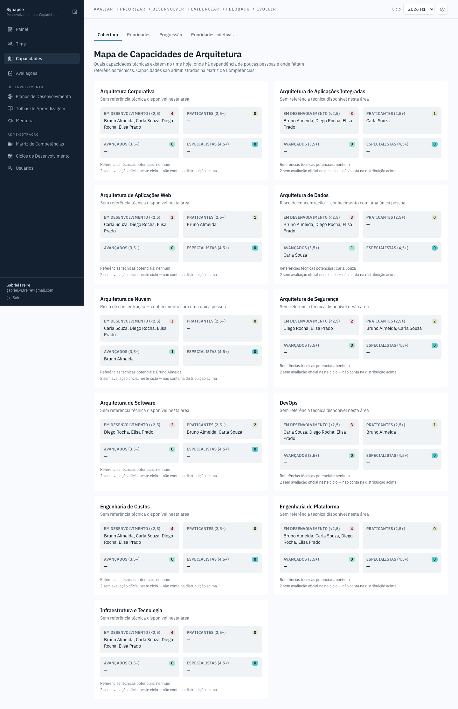

# Capacidades — Cobertura

Uma das quatro abas da tela de Capacidades. Visão por capacidade de
arquitetura (Corporativa, Dados, Nuvem, Segurança…) focada em risco
organizacional: quantas pessoas estão em desenvolvimento, praticantes,
avançadas ou especialistas em cada uma, e — o dado mais importante da tela —
se existe **alguma referência técnica disponível**, porque uma capacidade
inteira dependendo de uma única pessoa é o risco que esta aba existe para
expor.
