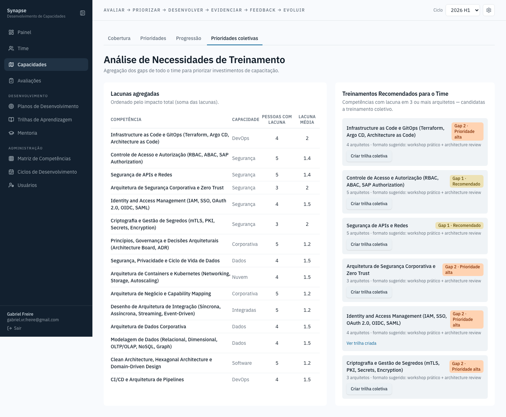

# Capacidades — Prioridades coletivas

Uma das quatro abas da tela de Capacidades. Agregação das lacunas do time
inteiro por competência, respondendo "se eu só pudesse investir num
treinamento este trimestre, qual entregaria mais valor para mais gente" —
uma lista ordenada por quantas pessoas compartilham aquela lacuna, com
sugestão de formato e um atalho para criar a trilha coletiva direto da
lacuna identificada.
