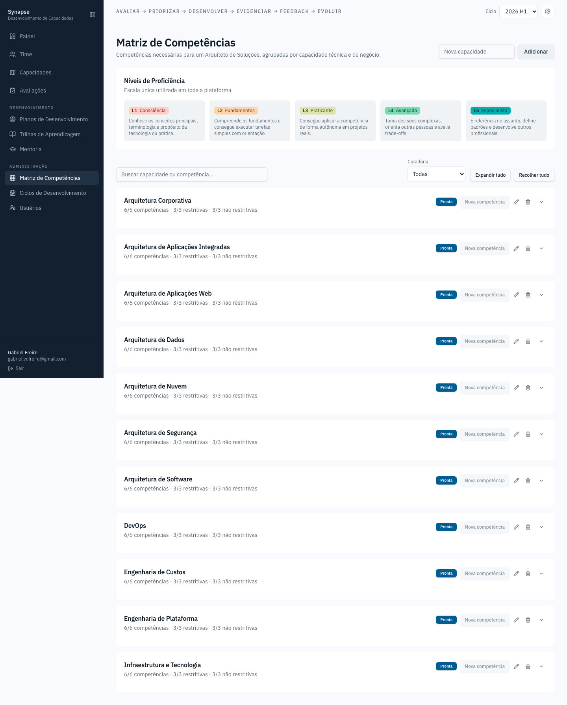

# Matriz de Competências

O catálogo mestre: toda competência técnica que o time avalia, agrupada por
capacidade, com o nível esperado por cargo. É daqui que nascem as opções que
aparecem em Avaliações, Planos de Desenvolvimento e Trilhas — mudar um nome
ou nível aqui propaga para o app inteiro. Permite criar capacidade nova,
criar competência dentro dela, editar (nome, tipo e níveis esperados) e
arquivar — uma competência com histórico de avaliação nunca é excluída de
verdade, só sai do catálogo ativo.

Cada capacidade nasce recolhida (contagem 6/3/3 e status de curadoria sempre
visíveis no cabeçalho do card) — a tabela de competências só aparece ao
expandir, individualmente ou com "Expandir tudo"/"Recolher tudo". Além da
busca (que também expande automaticamente o que casa com o termo), um filtro
por status de curadoria (Todas / Prontas / Requer curadoria) ajuda a achar
rápido o que ainda falta revisar.
