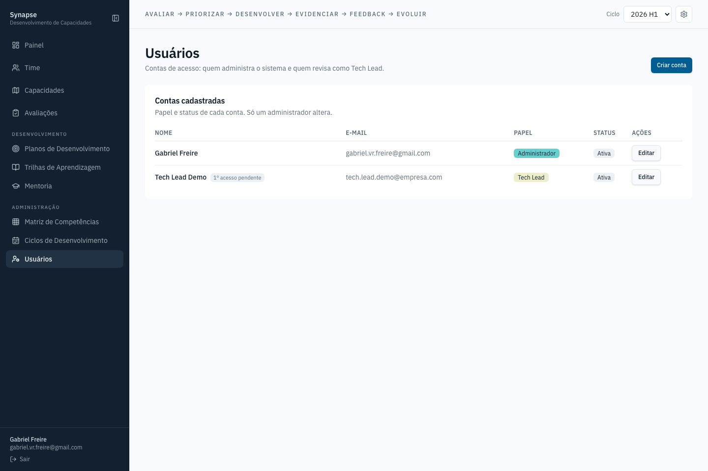

# Usuários

Contas de acesso: quem administra o sistema e quem revisa como Tech Lead. Um
administrador cria conta nova, muda papel e status (ativa/desabilitada) —
nunca exclui uma conta que já tem histórico de ações no sistema. Conceder
Admin a alguém exige uma etapa extra de confirmação antes de salvar.
