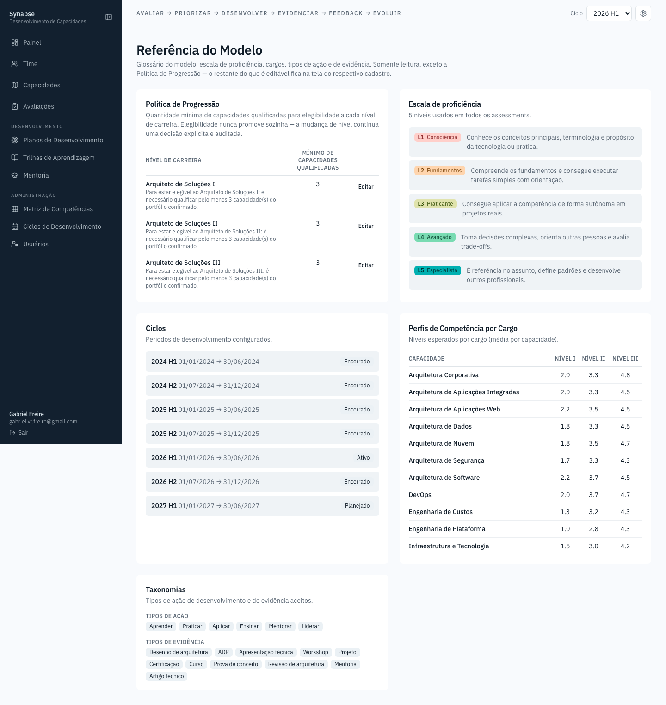

# Referência do Modelo

Glossário somente-leitura: a escala de proficiência (o que cada nível de 1 a
5 significa), os ciclos cadastrados, e as duas taxonomias fixas do modelo —
tipos de ação de desenvolvimento e tipos de evidência aceitos. Existe para
tirar dúvida sem precisar perguntar: "o que muda de um nível 3 para um nível
4?". Não aparece na barra lateral (o menu de preferências, ícone de
engrenagem no cabeçalho, cobre tema e idioma), mas continua acessível
diretamente em `/settings`.
