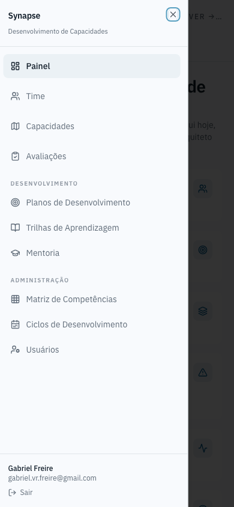

# Navegação mobile

Abaixo de um certo tamanho de tela, a barra lateral some e vira um botão de
hambúrguer no cabeçalho. Ele abre um drawer com a mesma hierarquia por seção
da barra lateral do desktop (grupos, ícones, item ativo destacado) — nunca
uma lista achatada à parte. Tocar num item navega e fecha o drawer sozinho.
